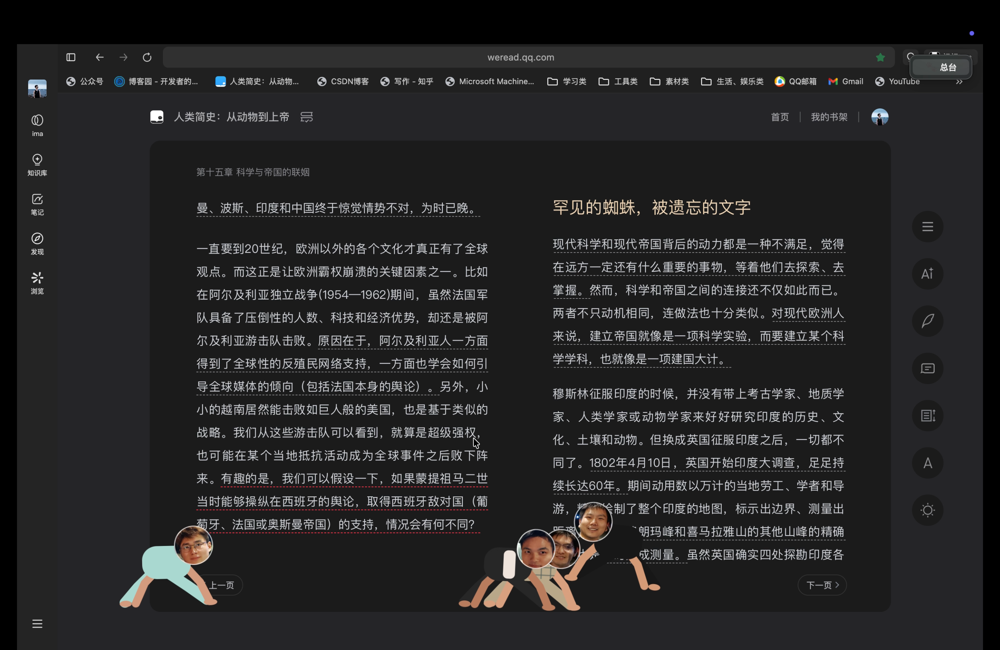
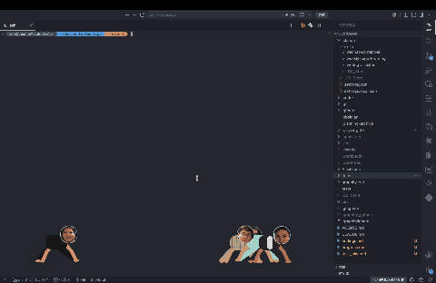
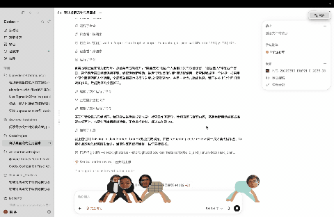

# DesktopPets

桌面宠物：一群会走动、会互动的桌面小精灵，常驻在托盘/菜单栏与桌面上。

- **平台**：macOS 13+（AppKit）/ Windows 10+ x64（Win32，同一 Swift 核心）
- **交互**：菜单栏/托盘总台 + 桌面独立面板双控制入口
- **人物**：macOS 内置 12 个头像、支持导入照片自定义；Windows 内置 4 个程序化人物
- **渲染**：透明无边框窗口、形状感知点击穿透、确定性固定步长世界模拟



*动态效果：*




> 上图：桌面动态效果与人物设置界面。录屏见 [Releases](https://github.com/Leon-Algo/mac-desktop-pets/releases) 页面。

## 构建与测试

```bash
swift build -c release -Xswiftc -strict-concurrency=complete   # 严格并发 Release
swift test                                                      # 单元测试
swift test --sanitize=address                                   # 地址消毒器
```

> 注：若在嵌套沙箱环境中 `swift test` 报
> `sandbox-exec: sandbox_apply: Operation not permitted`，追加 SwiftPM 官方参数
> `--disable-sandbox` 即可（仅关闭 SwiftPM 自身的清单沙箱，不影响语义）。

## 安装

### macOS

#### 方式一：下载 DMG（推荐普通用户）
1. 到 [Releases](https://github.com/Leon-Algo/mac-desktop-pets/releases) 下载 `DesktopPets.dmg`
2. 打开 DMG，把 `DesktopPets.app` 拖入 `Applications`
3. 首次打开若被 Gatekeeper 拦截（提示「无法验证开发者」），任选一种解除方式：
   - 右键 `DesktopPets.app` → 「打开」；或
   - 终端执行 `sudo xattr -dr com.apple.quarantine /Applications/DesktopPets.app`

> 本项目采用**路线 B 免费分发**：未做 Developer ID 签名与公证，因此首次打开会出现上述提示，属正常行为，不影响使用。

#### 方式二：源码编译（开发者）
本地编译的 app 不受 quarantine 隔离限制，无需解除：

```bash
git clone https://github.com/Leon-Algo/mac-desktop-pets.git
cd mac-desktop-pets
swift build -c release
swift run -c release
```

### Windows

#### 方式一：下载便携 zip（推荐普通用户）
1. 到 [Releases](https://github.com/Leon-Algo/mac-desktop-pets/releases) 下载 `DesktopPets-windows-x64.zip`
2. 右键 zip → 「全部解压」，选一个固定目录（建议 `D:\Tools\DesktopPets`，运行中不要移动/删除该目录）
3. 双击 `DesktopPets.exe` 运行
4. 首次运行若被 SmartScreen 拦截（提示「Windows 已保护你的电脑」）：
   - 点击「更多信息」，再点「仍要运行」即可

> 本项目未做代码签名（Authenticode），SmartScreen 提示属正常行为。便携版无安装器，删除目录即完成卸载；注册表 Run 键仅托盘勾选「开机自启」时写入 `HKCU\...\CurrentVersion\Run`。

#### 托盘菜单
运行后宠物出现在桌面上，系统托盘（任务栏右下角，可能折叠在 `^` 里）有图标：
- **开机自启**：勾选后写入当前用户注册表 Run 键，取消勾选即移除
- **退出桌面伙伴**：彻底退出

#### 桌面交互（与 macOS 一致）
- **单击宠物**：挥手打招呼
- **双击宠物**：所有宠物集合玩耍
- **按住拖动**：把宠物拎起来，松手放下
- **多显示器**：宠物在主屏活动；拔掉显示器或更改主屏后自动召回

#### 方式二：源码编译（开发者，需 Swift 6.3+ on Windows）
安装 [Swift on Windows](https://www.swift.org/install/windows/) 与 Visual Studio Build Tools（MSVC），然后：

```powershell
git clone https://github.com/Leon-Algo/mac-desktop-pets.git
cd mac-desktop-pets
swift build --product WindowsShell
.\.build\release\WindowsShell.exe
```

### 双平台功能对比

| 功能 | macOS | Windows |
|---|---|---|
| 桌面宠物模拟（走动/跳跃/攀爬/睡觉） | ✅ | ✅ 同一核心 |
| 单击打招呼 / 双击集合 / 拖拽 | ✅ | ✅ |
| 托盘/菜单栏 | 菜单栏 🐾 总台 + 控制中心面板 | 托盘图标（自启/退出） |
| 自定义头像/角色 | ✅ 照片导入裁剪 | ❌ 内置 4 个程序化人物 |
| 多显示器 | ✅ | ✅（显示变化自动召回） |
| 开机自启 | 登录项（SMAppService） | 注册表 Run 键（HKCU） |
| 分发 | DMG（未签名，右键打开） | 便携 zip（未签名，仍要运行） |

## 目录结构

- `Sources/DesktopPetsCore/` — 跨平台核心（世界模拟、交互、角色档案，纯 Foundation）
- `Sources/DesktopPets/` — macOS AppKit 壳（应用委托、窗口控制器、菜单栏、渲染）
- `Sources/WindowsShell/` — Windows Win32 壳（分层窗口、软件光栅器、托盘、多显示器）
- `Sources/CoreProbe/` — 跨平台无头自检可执行
- `Tests/` — 单元测试（含 ASan 覆盖）

## 数据与隐私

- 配置与头像持久化于 `~/Library/Application Support/DesktopPets/`
- 窗口几何仅通过 `CGWindowListCopyWindowInfo` 只读枚举，**不依赖**屏幕录制/辅助功能权限
- 头像导入本地标准化为 512×512 PNG，源文件受字节/像素上限约束

## 真人照片版权

`Sources/DesktopPets/Resources/Characters/Faces/` 下的四张人物照片**不属 MIT 许可**
范围，已获得照片本人的书面授权用于本应用，禁止在项目外复制/再分发。详见 `LICENSE`。

## 贡献

见 `CONTRIBUTING.md`。请确保所有改动附测试，并通过 `swift test --sanitize=address`
与严格并发 Release 构建。
